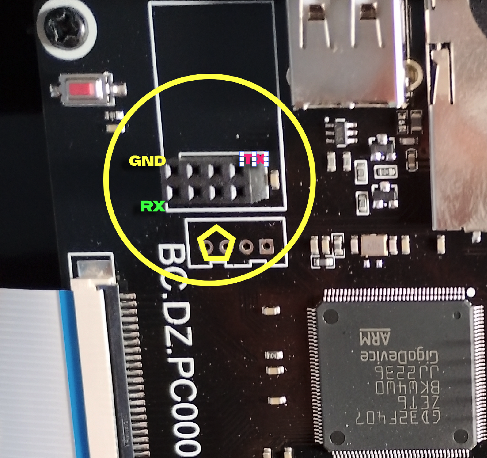
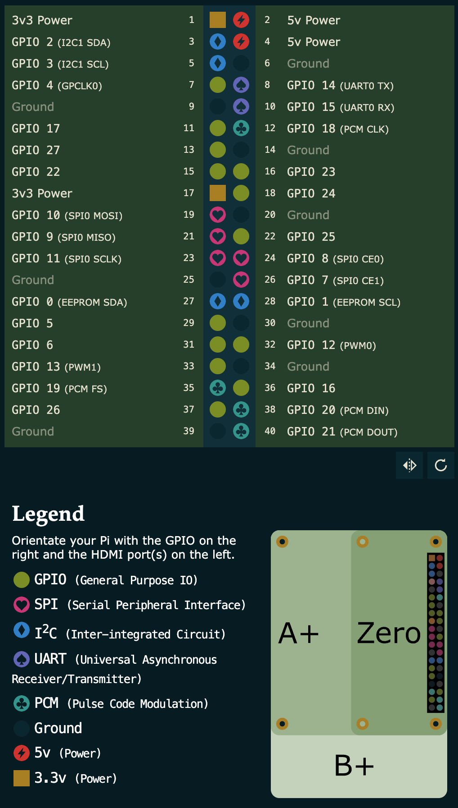

# Klipper for the Mingda Magician Max (GD32)

> ## ⚠️ DISCLAIMER — READ BEFORE STARTING
>
> - This modification requires **opening the printer and removing the bottom
>   cover** to access the mainboard, power supply and wiring.
> - There is an **electric shock hazard**. The PSU input is mains voltage, and
>   the PSU/mainboard can hold lethal voltages even after power-off.
>   **Unplug the printer from the wall before working on it**, and never touch
>   the mains/PSU section while powered.
> - Proceed only if you are comfortable with electronics and are careful.
>   **You do this at your own risk** — no warranty, and you can damage the
>   printer or injure yourself.

Minimal guide to replace the stock Marlin firmware with **Klipper**, talking to
a Raspberry Pi over a **serial (UART) link**. Assumes basic electronics skills
(soldering/wiring, DC-DC converters, SD cards).

Tested on: Mingda Magician Max (GD32F407VET6 mainboard) + Raspberry Pi Zero 2 W.

> The stock touchscreen is **not supported** by Klipper — you use Mainsail/Fluidd
> in a browser instead.

## Folder layout

This repository is only `klipper_printer/`. The Klipper **source is not
included** — only clone it next to this folder if you want to rebuild the
firmware.

```
your-folder/
├── klipper_printer/     <- this repo (firmware.bin, printer.cfg, macros.cfg, guide)
└── klipper/             <- Klipper source (only needed to rebuild)
```

## 1. Flash the firmware (SD card)

1. Format a microSD card as **FAT32**.
2. Copy `firmware.bin` to the **root** of the card (keep the name `firmware.bin`).
3. Printer **off** → insert the card → power **on**. The screen shows a flashing
   percentage.
4. When it finishes, **remove the card** and power-cycle the printer.

## 2. Wiring

You need a **DC-DC step-down module** (24 V → 5 V, **≥ 2 A**) to power the Pi
from the printer's PSU, and **3 jumper wires** for the UART.

### 2.1 Power the Pi

```
      Printer PSU (24 V)
      ┌─────────────────┐
      │   +24V     GND  │
      └───┬──────────┬──┘
          │          │
   ┌──────┴──────────┴──────┐
   │   DC-DC step-down      │
   │      24V → 5V          │
   │       (≥ 2 A)          │
   └──────┬──────────┬──────┘
        +5V│          │GND
           │          │
   ┌───────┴──────────┴────────────────┐
   │          Raspberry Pi             │
   │      5V in             GND        │
   └───────────────────────────────────┘
```

### 2.2 UART link (printer → Pi)

The printer has an 8-pin **"W1" / ESP8266 socket** carrying **USART3** —
circled on the mainboard below (`TX`, `RX`, `GND` marked):



```
        W1 / USART3 socket (front view)

        ┌─────────────────┐
        │ 1 RX     2 GND  │
        │ 3 EN     4 GPIO2│
        │ 5 RST    6 GPIO0│
        │ 7 3V3    8 TX   │
        └─────────────────┘

   Pi GPIO14 (TX, pin 8)   ───────────────►  pin 8  (TX)
   Pi GPIO15 (RX, pin 10)  ◄───────────────  pin 1  (RX)
   Pi GND    (GND, pin 6)  ────────────────  pin 2  (GND)
```

- The socket's `TX`/`RX` labels are the **module's** signals (it's a female
  socket for an ESP module), so they are crossed relative to the printer's MCU:
  the printer **MCU RX is on pin 8 (`TX`)** and **MCU TX is on pin 1 (`RX`)**.
  Connect Pi **TX → pin 8** and Pi **RX → pin 1**. If there is no connection,
  swap pins 1 and 8.
- Leave every other pin unconnected (notably pin 7, 3.3 V).
- 3.3 V logic; grounds are already common through the step-down.
- Remove any ESP8266 module from the socket.

Raspberry Pi GPIO header — you use **pin 8 = GPIO14 (UART0 TX)**,
**pin 10 = GPIO15 (UART0 RX)** and a **GND** (e.g. **pin 6**):



## 3. Raspberry Pi software

1. Install Raspberry Pi OS and use **KIAUH** to install
   **Klipper + Moonraker + Mainsail**.
2. Enable the Pi's UART. In `/boot/firmware/config.txt` add:
   ```
   enable_uart=1
   dtoverlay=disable-bt
   ```
   then:
   ```
   sudo systemctl disable hciuart 2>/dev/null
   sudo reboot
   ```
   Verify: `ls -l /dev/serial0` → should point to `ttyAMA0`.
3. Copy `printer.cfg`, `macros.cfg` and `moonraker.conf` into
   `~/printer_data/config/`.
   (`moonraker.conf` adds the **Sound** on/off switch to the Mainsail dashboard
   — see section 6. It is otherwise optional.)
   Then optionally install the shutdown tune (section 8).

## 4. First start

Power the printer first, then the Pi. Open Mainsail — the MCU should come
online (serial `/dev/serial0`, 250000 baud). If it does, you're done with setup.

## 5. Calibrate (do this once)

Z homes on the **IR endstop**, which is contactless — the nozzle never touches
the bed. That means `Z=0` is the IR trigger, a few mm **above** the bed, and the
bed mesh provides the remaining offset. So do **both** calibrations below before
your first print.

All macros preheat the bed to **60 °C** and the hotend to **200 °C** and home
(IR) for you, so you only have to send one command each. `G28` lifts **Z by 5 mm
before homing X/Y** (`[homing_override]`) so the nozzle can't drag on the bed;
only `PROBE_CALIBRATE` centres the toolhead (the probe needs to be over the bed).

### 5.1 Probe / Z-offset — `PROBE_CALIBRATE`

Sets the distance between the probe trigger and the nozzle tip (`z_offset`).

1. Send:
   ```
   PROBE_CALIBRATE
   ```
   It heats the bed/hotend, homes all axes, **centres the toolhead over the bed**
   (`X160 Y160`) and starts the manual probe ~5 mm above the bed.
2. Lower the nozzle in small steps until a sheet of paper has **slight drag**.
   Use the Mainsail `TESTZ` buttons, the `Z_DOWN` / `Z_UP` macros, or the console:
   ```
   TESTZ Z=-1        ; repeat ~5x to get close
   TESTZ Z=-0.1      ; fine steps until the paper drags
   ```
3. `ACCEPT` then `SAVE_CONFIG` — this writes `z_offset` to `printer.cfg`.

### 5.2 Bed mesh — `G29`

Maps the bed so the first layer follows any warp or tilt.

1. Send:
   ```
   G29
   ```
   It preheats (60 / 200 °C), homes (IR), then probes a **4 × 4** grid
   (3 samples per point). The result is saved as the profile `default`.
2. Run `SAVE_CONFIG` to persist it.

The mesh is applied **automatically** on every Klipper start (the `LOAD_MESH`
delayed-gcode) and again by `START_PRINT`, so you do **not** need to re-run `G29`
each print — only after moving the printer or changing the bed/nozzle.

> First layer a touch high or low? That's `z_offset`: nudge it with
> `SET_GCODE_OFFSET Z=±0.02` → `Z_OFFSET_APPLY_PROBE` → `SAVE_CONFIG`, or simply
> re-run `PROBE_CALIBRATE`.

### 5.3 PID (heaters)

```
PID_CALIBRATE HEATER=extruder TARGET=200
SAVE_CONFIG
PID_CALIBRATE HEATER=heater_bed TARGET=60
SAVE_CONFIG
```

## 6. Macros, sounds & mute

### Preheat macros

Set the heaters for a material (they only set the targets — add `M190`/`M109`
if you want to wait):

| Macro | Bed | Hotend |
|---|---|---|
| `PREHEAT_PLA` | 60 °C | 200 °C |
| `PREHEAT_PETG` | 80 °C | 240 °C |
| `PREHEAT_ABS` | 100 °C | 250 °C |
| `PREHEAT_TPU` | 50 °C | 230 °C |

### Sounds (passive buzzer on PG11)

The buzzer plays short tunes: **3 beeps** at `START_PRINT`, a **"beep boop" ×4**
on `PAUSE`, and a finish **jingle** on `END_PRINT`. `M300 S<Hz> P<ms>` plays a
single note (e.g. `M300 S1000 P200`). The buzzer uses `[pwm_cycle_time beeper]`
so the frequency can change at runtime.

### Mute switch

A **Sound** switch appears in the Mainsail dashboard (top bar). Turning it **off**
mutes `M300` and every tune. It is a Moonraker `klipper_device` mapped to the
`_SOUND` macro:

```ini
# moonraker.conf
[power Sound]
type: klipper_device
object_name: gcode_macro _SOUND
```

Manual control: `SOUND_ON`, `SOUND_OFF`, `SOUND_TOGGLE`. The mute state resets to
**on** after a Klipper restart.

## 7. Input shaping

Enabled with measured frequencies:

```ini
[input_shaper]
shaper_type: ei
shaper_freq_x: 25.5
shaper_freq_y: 74.7
```

Without an accelerometer, measure the ringing frequency with the manual
ringing-tower test:

1. Slice `~/klipper/docs/prints/ringing_tower.stl` (0.2–0.25 mm layers, no infill,
   1–2 perimeters, outer walls 80–100 mm/s, min layer time ≤ 3 s, don't rotate).
2. In the console:
   ```
   RESTART
   SET_VELOCITY_LIMIT MINIMUM_CRUISE_RATIO=0
   SET_PRESSURE_ADVANCE ADVANCE=0
   SET_INPUT_SHAPER SHAPER_FREQ_X=0 SHAPER_FREQ_Y=0
   TUNING_TOWER COMMAND=SET_VELOCITY_LIMIT PARAMETER=ACCEL START=1500 STEP_DELTA=500 STEP_HEIGHT=5
   ```
3. Print it; on each axis measure the distance **D** across **N** ripples (skip
   the first 1–2), then `freq = V · N / D` (V = outer-wall speed).
4. Put the numbers in `[input_shaper]` and restart. **EI** is usually best for a
   bed-slinger. Once shaping is on you can raise `max_accel` (currently 800).

> `SET_INPUT_SHAPER` only changes the running session — it is **not** saved by
> `SAVE_CONFIG`; the values must be in `printer.cfg`.

## 8. Shutdown tune (Pi)

Plays the XP-style melody on the buzzer on a **graceful Pi shutdown** (Mainsail's
*Shutdown host*, `sudo shutdown`, `sudo reboot`, …). Klipper/Moonraker are still
running at that moment, so the tune is sent before they stop.

Two files are shipped: `shutdown_tune.sh` (sends `PLAY_SHUTDOWN_TUNE` via
Moonraker, then waits) and `printer-shutdown-tune.service` (systemd unit whose
`ExecStop` runs it **before** Klipper/Moonraker are stopped). Install on the Pi:

```
sudo cp ~/printer_data/config/printer-shutdown-tune.service /etc/systemd/system/
sudo systemctl daemon-reload
sudo systemctl enable --now printer-shutdown-tune.service
```

> Only works for a **graceful shutdown** — not on power loss, and not on a Klipper
> error shutdown (macros don't run in that state).

## 9. Troubleshooting

| Symptom | Fix |
|---|---|
| No `/dev/serial0` | `enable_uart=1` + `dtoverlay=disable-bt` not applied; reboot |
| "Unable to connect" | TX/RX swapped, or ESP8266 module still in the socket |
| `TMC ... ShortToSupply` | Z/Z1 already run spreadCycle; check the motor connector |
| Screen stays blank | Expected — stock TFT unsupported |
| First layer too high/low | Re-run `PROBE_CALIBRATE`, or `SET_GCODE_OFFSET Z=...` |
| No buzzer sounds | Check the **Sound** switch / run `SOUND_ON` |
| No sound on shutdown | Must be a graceful Pi shutdown (section 8) |

## Rebuild the firmware (optional)

Clone the Klipper source **as a sibling of this folder** (so it lands in
`../klipper`):

```
# from the parent folder that contains klipper_printer/
git clone https://github.com/Klipper3d/klipper
```

Then build:

```
cd klipper_printer
./build_klipper_fw.sh
```

The script builds the firmware (USART3) and produces `firmware.bin`. It needs an
ARM GCC toolchain (with newlib); on macOS the PlatformIO toolchain or
`gcc-arm-embedded` works.

Manual build? See **[menuconfig.md](menuconfig.md)** for the full `make menuconfig`
settings, the equivalent `.config` and macOS notes.
